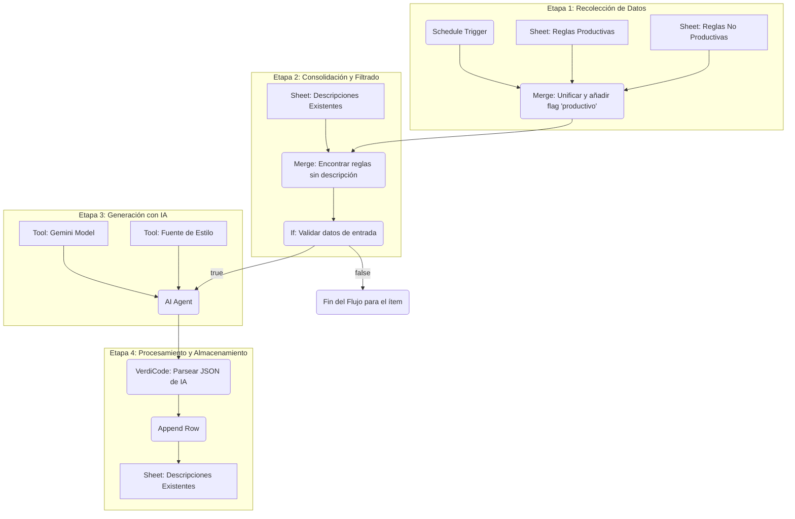

# Documentación Funcional del Flujo de n8n

## 1. Visión General

Este flujo de trabajo está diseñado para automatizar la generación de descripciones técnicas para "reglas" y "killers" de negocio que aún no cuentan con una. El proceso identifica reglas sin descripción en las fuentes de datos, utiliza un modelo de lenguaje (IA) para crear una descripción coherente y estandarizada, y finalmente almacena el nuevo contenido en una hoja de cálculo designada.

El objetivo principal es mantener un diccionario de reglas completo y actualizado, asegurando que todas las entradas tengan una descripción funcional clara, siguiendo una taxonomía y estilo predefinidos.

---

## 2. Flujo de Ejecución Detallado

El proceso se puede dividir en las siguientes etapas lógicas:

### Etapa 1: Disparo y Recolección de Datos

1.  **Disparador (Trigger)**: El flujo se activa automáticamente una vez al día a las 2:00 AM (`Schedule Trigger`). También puede ser ejecutado manualmente para procesar datos bajo demanda.

2.  **Lectura de Fuentes**: El flujo accede a un documento de Google Sheets llamado `EOC - Diccionario Reglas & Killers & Politica & Campana - INTERNO` y lee datos de dos hojas distintas:
    *   `Get row(s) in sheet1`: Obtiene la lista de todas las reglas y killers marcados como **productivos**.
    *   `Get row(s) in sheet`: Obtiene la lista de todas las reglas y killers marcados como **no productivos**.

### Etapa 2: Consolidación y Filtrado

3.  **Unificación de Datos (Merge)**: Los dos listados (productivos y no productivos) se combinan en una única tabla de datos. Durante este proceso, se añade una nueva columna booleana llamada `productivo` (`true` para los productivos, `false` para los no productivos) para poder identificar su origen.

4.  **Identificación de Pendientes (Merge1)**: La lista consolidada se cruza con la hoja `Descripcion R/K`, que contiene las descripciones ya generadas. Este nodo se configura para **mantener únicamente las filas que no tienen una coincidencia** por `ID EN EOC`. El resultado es una lista de reglas y killers que **aún no tienen una descripción generada**.

5.  **Validación de Datos (If)**: Cada elemento de la lista de pendientes pasa por un filtro final. Se asegura de que la fila cumpla tres condiciones para ser procesada:
    *   El campo `DEFINICIÓN DE LA REGLA/KILLER` debe estar vacío.
    *   El campo `NOMBRE EN EOC` no debe estar vacío.
    *   El campo `CONDICIÓN EN EOC` no debe estar vacío.

    Solo las filas que cumplen estas condiciones (es decir, que tienen la información necesaria pero carecen de descripción) avanzan a la siguiente etapa.

### Etapa 3: Generación de Contenido con IA

6.  **Agente de IA (AI Agent)**: Este es el núcleo del flujo. Para cada regla/killer pendiente, este nodo prepara y envía una solicitud a un modelo de lenguaje (Gemini).
    *   **Prompt**: Se construye un prompt dinámico que incluye el `ID`, `NOMBRE EN EOC`, `CONDICIÓN EN EOC` y el estado `productivo` de la regla.
    *   **Instrucciones**: El prompt contiene reglas estrictas que el modelo debe seguir:
        *   **Taxonomía**: Si el ID empieza con `K`, la descripción debe empezar con "Excluye...". Si empieza con `R`, debe empezar con "Incluye...".
        *   **Contenido**: Debe interpretar el `NOMBRE` (ej. "MXP" como "monto por plazo") y resumir la `CONDICIÓN` si es muy extensa.
        *   **Fuente de Estilo**: Utiliza una herramienta (`Fuente`) que le provee acceso de solo lectura a un Google Sheet con ejemplos de descripciones existentes. Esto sirve para que la IA aprenda el vocabulario, tono y formato técnico, sin copiar el contenido directamente.
        *   **Formato de Salida**: La respuesta debe ser obligatoriamente un JSON con la estructura: `{"id": "...", "nombre": "...", "descripcion": "...", "productivo": ...}`.

### Etapa 4: Procesamiento y Almacenamiento

7.  **Limpieza del Resultado (VerdiCode)**: La respuesta del modelo de IA, que es un string de texto, se procesa con un script de Python. Este script limpia la respuesta (eliminando posibles caracteres extra como "```json"), la convierte en un objeto JSON válido y extrae los campos `id`, `nombre`, `descripcion` y `productivo` en una estructura de datos limpia y manejable para n8n.

8.  **Escritura en Hoja de Cálculo (Append row in sheet)**: El JSON limpio y procesado se utiliza para añadir una nueva fila en la hoja `Descripcion R/K` del Google Sheet. Se mapean los campos `id`, `nombre` y `descripcion` a las columnas correspondientes: `ID EN EOC`, `NOMBRE EN EOC` y `DEFINICIÓN DE LA REGLA/KILLER`.

Al completar este paso, la regla ya cuenta con una descripción en el sistema, por lo que no será procesada en futuras ejecuciones del flujo.

---

## 3. Diagrama de Flujo Lógico

