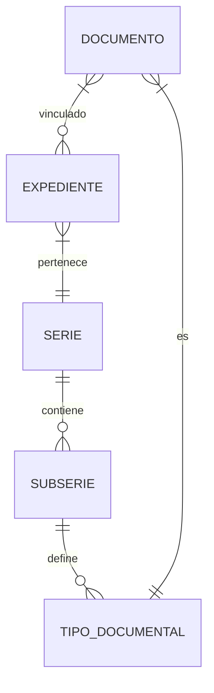

# Especificaciones Detalladas del Sistema (EDS) - SGD Argentina

## 1. INTRODUCCIÓN (Detalle de Implementación)

### 1.1 Objetivos Técnicos Primarios
El sistema debe trascender la simple gestión de archivos para convertirse en un **Repositorio de Confianza (Trusted Repository)**. Esto implica:
*   **Integridad Demostrable**: Uso de hashes SHA-256 encadenados y sellado de tiempo (TSA) para garantizar que ningún bit ha cambiado desde la captura.
*   **Disponibilidad Permanente**: Arquitectura basada en micro-servicios (Go) y almacenamiento de objetos (MinIO) que permite escalado horizontal sin pérdida de servicio.
*   **Cumplimiento "by Design"**: La lógica de negocio integra las restricciones de las leyes 25.506 y 25.326 en el código (middleware de validación, triggers de auditoría).

### 1.2 User Personas y Flujos Típicos
| Persona | Perfil | Caso de Uso Crítico | Nivel de Detalle Requerido |
| :--- | :--- | :--- | :--- |
| **Administrador Legal** | Abogado / Escribano | Firma digital masiva y verificación de validez. | Traceability legal total, validación CRL/OCSP. |
| **Gestor Administrativo** | Contable / RRHH | Clasificación por series y retención. | Automatización de metadatos, alertas de vencimiento. |
| **Auditor Externo** | Consultor ISO/Seguridad | Revisión de logs de acceso. | Logs inmutables, reportes de "quién vio qué". |
| **Usuario Operativo** | Empleado SME | Captura rápida y búsqueda. | OCR automático, UI intuitiva (Material 3). |

---

## 2. REQUERIMIENTOS FUNCIONALES DETALLADOS

### 2.1 Gestión del Ciclo de Vida Documental (ISO 15489)

#### 2.1.1 Captura e Ingreso - Detalle Técnico
La captura no es solo un "upload". Requiere una tubería de procesamiento:

**A. Pipeline de Ingreso:**
1.  **Recepción**: Multipart upload vía API REST (Endpoint: `POST /api/v1/documents`).
2.  **Validación de Formato**: Uso de `libmagic` para verificar MIME types reales, no solo extensiones.
3.  **Extracción de Metadatos Técnicos**: `ExifTool` para imágenes/PDFs.
4.  **Generación de Hash**: SHA-256 calculado en streaming para no saturar RAM.
5.  **Virus Scan**: Integración opcional con `ClamAV` vía socket.

**B. Interfaz de Escaneo (Componente Proxy):**
Para cumplir con SANE/TWAIN desde la web, se implementará un **Local Agent** (escrito en Go o C#) que:
*   Expone un servidor websocket local (`localhost:8989`).
*   La app Flutter se conecta al websocket para enviar comandos: `START_SCAN`, `SELECT_SOURCE`.
*   El agente devuelve el stream de imágenes directamente al SGD.

#### 2.1.2 Clasificación y Organización
El sistema jerárquico se basa en un **Cuadro de Clasificación Documental (CCD)** persistido en PostgreSQL:



*   **Metadatos Dinámicos**: Implementados mediante un campo `JSONB` en PostgreSQL para permitir flexibilidad total sin alterar el esquema de tablas.
*   **Expedientes**: Identificador humano configurable: `[PREFIJO]-[AÑO]-[SECUENCIA]` (ej. `JUD-2024-000123`).

#### 2.1.3 Versionado Inmutable (Deep Dive)
Cada archivo en MinIO se guarda bajo su hash. La base de datos gestiona la relación semántica:

*   **Lógica de Versionado**:
    *   `v1.0.0`: Documento original aprobado.
    *   `v1.1.0`: Cambio en metadatos o edición menor.
    *   `v2.0.0`: Nueva carga de archivo (Check-in).
*   **Inmutabilidad**: El bucket de MinIO tendrá configurada la política de **Object Locking** (WORM - Write Once Read Many) por el periodo de retención legal.

#### 2.1.4 Almacenamiento y Capas (Tiering)
*   **Hot Tier (PostgreSQL + MinIO SSD)**: Documentos activos (< 2 años).
*   **Warm Tier (MinIO HDD)**: Documentos en periodo de retención pasiva.
*   **Cold Tier (Amazon S3 Glacier / Azure Archive)**: Documentos para preservación histórica de 10+ años.

#### 2.1.5 Búsqueda: Motor de Indexación
Uso de **Elasticsearch 8.x**:
*   **Full-Text Search**: Los PDF se pasan por `Tesseract OCR` si no tienen capa de texto. El resultado se indexa.
*   **Búsqueda Facetada**: Por autor, fecha, tipo y serie simultáneamente.
*   **Relevancia**: Algoritmo BM25 configurado para dar peso a metadatos manuales sobre el contenido del texto.

#### 2.1.7 Workflow y Procesos
*   **Motor de Workflow**: Basado en **Go-BPMN** o un motor de estados finito (FSM) a medida.
*   **Notificaciones**: Integración con servicios de email (SMTP/SendGrid) y Push Notifications (Firebase) para aprobaciones pendientes.

### 2.2 Control de Accesos y Seguridad (ISO 27001)

#### 2.2.1 Autenticación y Keycloak
*   **Proveedor de Identidad (IdP)**: **Keycloak** gestionará el ciclo de vida de usuarios, passwords y MFA.
*   **Multi-Factor (MFA)**: Soporte para TOTP (Google Authenticator) y WebAuthn (llaves de seguridad físicas).
*   **Sesiones**: Tokens JWT (JSON Web Token) con tiempo de vida corto (15 min) y Refresh Tokens rotativos persistidos en Redis.

#### 2.2.2 Autorización Granular (RBAC + ABAC)
*   **Modelo Híbrido**:
    *   **RBAC (Roles)**: Define qué funciones puede usar el usuario (ej. `Role_Signer`, `Role_Auditor`).
    *   **ABAC (Atributos)**: Define sobre qué documentos puede actuar (ej. `Document.SecurityClass <= User.ClearanceLevel`).
*   **Herencia de Permisos**: Si un usuario tiene acceso a un Expediente, hereda acceso a todos sus documentos internos, a menos que exista un "deny" explícito.

### 2.3 Firma Digital y Trazabilidad Legal (Ley 25.506)

#### 2.3.1 Arquitectura de Firma PAdES
El sistema implementará firmas nivel **PAdES-B-LT** (Basic Long Term) para asegurar validación futura:
*   **Componente de Firma**: Integración con certificados en token (PKCS#11) o en nube (Cloud Signing).
*   **Proceso de Compulsa**:
    1.  Cálculo de Digest localmente.
    2.  Envío de Digest al dispositivo de firma (el archivo original NUNCA sale del servidor).
    3.  Incrustación del valor de firma y certificados en el PDF.
*   **Verificación**: Uso de la librería `dss` (Digital Signature Service) para validar contra las TSL (Trusted Service Lists) de Argentina (ONTI).

#### 2.3.2 Estampado de Tiempo (TSA)
*   Integración con Autoridades de Sellado de Tiempo certificadas en Argentina.
*   Se aplica un sello de tiempo inmediatamente después de:
    *   La firma digital (para fijar el momento exacto de la firma).
    *   El cierre de un expediente (para inmutabilidad histórica).

### 2.4 Auditoría y Trazabilidad Completa (ISO 30301)

#### 2.4.1 Estructura del Log de Auditoría
Los logs no se guardan en una tabla común modificable. Se implementa una **Cadena de Auditoría Hash-Linked**:

```json
{
  "event_id": "uuid-123",
  "prev_hash": "hash-del-evento-anterior",
  "timestamp": "2024-01-23T16:00:00Z",
  "actor": "user-456",
  "action": "DOCUMENT_VIEW",
  "resource": "doc-789",
  "signature": "firma-rsa-del-sistema"
}
```
*   **Inmutabilidad**: Cada entrada contiene el hash de la anterior, haciendo que cualquier alteración sea detectable.
*   **Side-logging**: Los logs se envían en tiempo real a un servidor de logs centralizado (ELK Stack) fuera del alcance de los administradores del SGD.

#### 2.4.2 Reportes Forenses
Capacidad de generar un "Timeline de Vida" de un documento que muestre cada interacción desde su creación hasta su disposición final, exportable en PDF con firma del sistema.

### 2.5 Protección de Datos Personales (Ley 25.326)

#### 2.5.1 Identificación y Reducción de Riesgos
*   **Módulo de Catalogación de PII**: El sistema permitirá marcar campos de metadatos como "Personal" o "Sensible".
*   **Anonimización Dinámica**: Para roles que no requieran ver el dato (ej. Auditor externo), el sistema ofuscará el contenido (ej. `20-*******-5` en lugar de un CUIT completo).
*   **Derecho de Supresión (Cancelación)**: Implementación de "Eliminación Lógica" con periodo de guarda técnico antes de la purga física (borrado criptográfico de la clave de cifrado del archivo).

#### 2.5.2 Registro de Transferencias
Cada vez que un documento marcado con PII es descargado o compartido externamente, se genera un registro automático en el log de auditoría detallando el destinatario y el fundamento legal de la transferencia.

### 2.6 Colaboración y Compartición Segura

#### 2.6.1 Compartición Externa (Secure Links)
*   **Mecanismo**: Generación de tokens de acceso único (UUIDv4) con expiración configurable.
*   **Seguridad**:
    *   Contraseña obligatoria enviada por un canal secundario.
    *   Marca de agua dinámica: "Visualizado por [Email Receptor] el [Fecha]" incrustada en el PDF en tiempo real.
    *   Limite de visualizaciones (ej. el link deja de funcionar tras 3 aperturas).

#### 2.6.2 Anotaciones y Comentarios
*   Los comentarios se almacenan en una tabla separada vinculada al `DocumentID`.
*   No modifican el stream de bits del archivo original para mantener la integridad del hash inmutable.

### 2.7 Integración y Extensibilidad

#### 2.7.1 API RESTful (Postman/Swagger)
*   **Documentación**: Generada automáticamente mediante `swag` (Go) o integrada en la interfaz para desarrolladores.
*   **Autenticación API**: Uso de **API Keys** para servidores y **Tokens OAuth2** para aplicaciones de terceros.
*   **Webhooks**:
    *   Eventos disponibles: `DOCUMENT_CREATED`, `SIGNATURE_COMPLETED`, `EXPEDIENTE_CLOSED`, `RETENTION_EXPIRED`.
    *   Reintentos automáticos con Backoff Exponencial en caso de fallo del sistema externo.

#### 2.7.2 Integración Office Online
Integración vía protocolo **WOPI** (Web Application Open Platform Interface) para permitir la edición concurrente de documentos `.docx` o `.xlsx` sin salir del navegador, asegurando que cada guardado genere una versión nueva en el SGD.

### 2.8 Reportes y Analytics

*   **Ingesta**: Uso de un worker de Go que procesa los logs de auditoría y actualiza tablas de agregación en PostgreSQL.
*   **Visualización**: Dashboard en Flutter utilizando la librería `fl_chart`.
*   **Métricas Críticas**:
    *   **Throughput**: Documentos procesados por hora.
    *   **Compliance Score**: % de documentos con metadatos obligatorios completos.
    *   **SLA de Workflow**: Tiempo promedio de aprobación por área.

---

## 3. REQUERIMIENTOS NO FUNCIONALES (Estrategia Técnica)

### 3.1 Rendimiento y Escalabilidad
*   **REQ-NF-001 (Búsqueda)**: Implementación de índices invertidos en Elasticsearch para consultas < 2s.
*   **REQ-NF-010 (Escalabilidad)**: Arquitectura Stateless en Go que permite el auto-escalado horizontal mediante HPA (Horizontal Pod Autoscaler) en Kubernetes.
*   **Caching Layer**: Uso de **Redis** para cachear metadatos de documentos frecuentes y sesiones de usuario.
*   **Load Balancing**: **Nginx** o **Traefik** como ingress controller en Kubernetes para distribuir carga entre múltiples instancias del backend en Go.
*   **Optimización de Archivos**: Generación de miniaturas (thumbnails) y versiones livianas de PDFs en background para carga instantánea de previsualizaciones.

### 3.2 Disponibilidad y DR (Disaster Recovery)
*   **REQ-NF-006 (Uptime)**: Disponibilidad del 99.5% garantizada por el uso de nodos redundantes en múltiples zonas de disponibilidad.
*   **Alta Disponibilidad (HA)**: Base de datos PostgreSQL con replicación Streaming (Primary/Standby).
*   **RPO/RTO**: Backups de base de datos cada 15 min (Point-in-Time Recovery) y replicación de MinIO a un sitio secundario.

### 3.3 Seguridad Avanzada (ISO 27001 Compliance)
*   **REQ-NF-014 (Cifrado)**: Cifrado AES-256 manejado por el storage engine para datos en reposo.
*   **WAF (Web Application Firewall)**: Filtrado de ataques SQLi, XSS y Path Traversal antes de llegar al backend.
*   **Cifrado en Reposo**: Implementado a nivel de sistema de archivos o mediante el motor de cifrado nativo de MinIO (KMS).

---

## 4. CASOS DE USO Y ESCENARIOS POR SECTOR

### 6.1 Estudio Jurídico y Escribanías
*   **Escenario**: Firma de contratos de alquiler con validez legal.
*   **Detalle**: Uso de firma digital calificada (ONTI) para asegurar que el documento tiene la misma validez que una firma manuscrita certificada por escribano.

### 6.2 Estudio Contable y Pymes
*   **Escenario**: Retención legal de facturas por 10 años.
*   **Detalle**: Configuración de políticas de retención automática que bloquean la eliminación de archivos hasta cumplirse el plazo fiscal de la AFIP.

---

## 5. MAPEO A LA ARQUITECTURA (Implementation Blueprint)

| Requisito | Componente Backend (Go) | Componente Frontend (Flutter) | Infraestructura |
| :--- | :--- | :--- | :--- |
| **Búsqueda OCR** | `Feature/Search` + Tesseract | `SearchPage` + Highlight | Elasticsearch |
| **Firma Digital** | `Feature/Signature` + DSS | `SignatureModal` + Webview | PKI Argentina |
| **Auditoría** | `Middleware/Audit` + Hash Chain | `AuditLogView` | ELK / PostgreSQL |
| **Almacenamiento** | `Adapter/MinIO` | `FileUploadWidget` | MinIO / S3 |
| **Auth/MFA** | `Adapter/Keycloak` | `LoginPage` + OTP Field | Keycloak |
| **Retención** | `Worker/Retention` | `Settings/PolicyView` | PostgreSQL Triggers |

---

## 6. MATRIZ DE CUMPLIMIENTO (Compliance Matrix)

El sistema garantiza el cumplimiento de las normativas mediante implementaciones específicas:

| Norma/Ley | Implementación Técnica | Relevancia |
|:---|:---|:---|
| **Ley 25.506 (Firma Digital)** | Integración con TSL de ONTI, soporte PAdES-LT, Sellado de Tiempo. | Validez legal plena en Argentina. |
| **Ley 25.326 (Habeas Data)** | Módulo de Privacidad, Derechos ARCO, Cifrado AES-256. | Protección de datos personales y sensibles. |
| **ISO 15489 (Gestión Doc)** | Cuadro de Clasificación Documental, Versionado Inmutable. | Estándar internacional de gestión de registros. |
| **ISO 27001 (Seguridad)** | RBAC/ABAC, Keycloak, WAF, Auditoría Inmutable. | Gestión de seguridad de la información. |

---

## 7. GLOSARIO TÉCNICO

*   **PAdES (PDF Advanced Electronic Signatures)**: Conjunto de extensiones al formato PDF para firma digital.
*   **WORM (Write Once Read Many)**: Política de almacenamiento que impide la modificación o eliminación de datos.
*   **CRL/OCSP**: Protocolos para verificar el estado de revocación de un certificado digital.
*   **WAF (Web Application Firewall)**: Barrera de seguridad para filtrar tráfico malicioso hacia la web.
*   **TSA (Time Stamping Authority)**: Tercero de confianza que certifica el momento exacto de una acción.

---

Este documento ahora refleja la totalidad de los requerimientos funcionales y técnicos, sirviendo como guía definitiva para la implementación del SGD.
